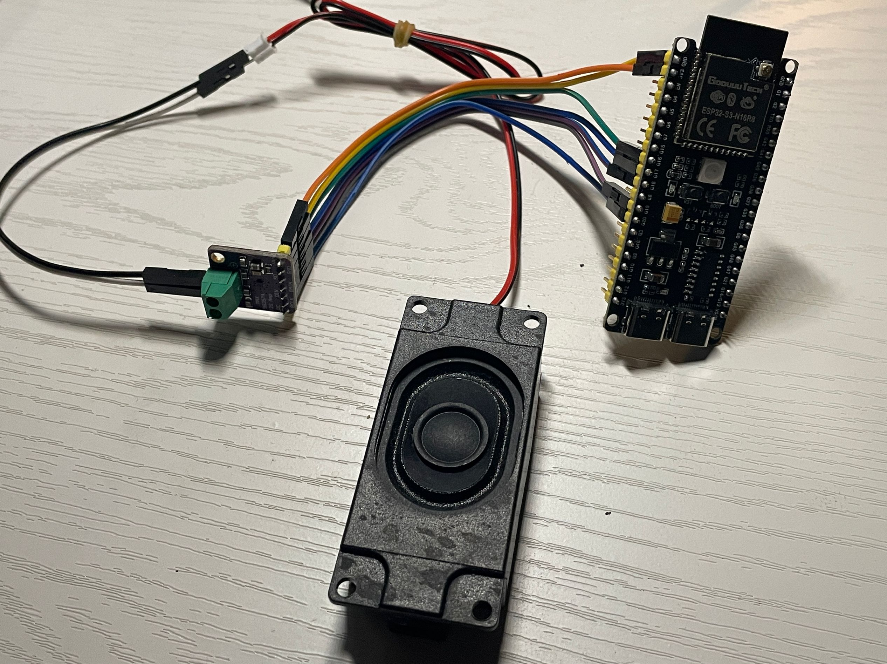

# ESP32 + MAX98357A 音频播放项目

## 项目简介

我最近在学习ESP32的I2S接口，实现了一个简单的音频播放Demo。
这个Demo通过 ESP32 微控制器与 MAX98357A I2S 数字放大器实现音频播放功能，展示了如何使用 I2S 接口播放预定义的音乐旋律。

## 硬件组成

- **ESP32 开发板**
- **MAX98357A I2S 数字放大器**
- **扬声器或耳机**
- **连接线**

## 软件依赖

- **ESP-IDF 开发框架**
- **C 编程环境**

## 项目结构

```
ESP32_MAX98357A_Demo/
├── main/
│   └── main.c
├── README.md
└── ...
```

## 硬件连接

将 ESP32 与 MAX98357A 连接如下：



- **I2S0_BCLK** (GPIO 19) -> **BCLK**
- **I2S0_WS** (GPIO 20) -> **WS**
- **I2S0_DO** (GPIO 18) -> **DIN**
- **I2S0_DI** (-1) -> 不连接
- **电源和地线** -> 按照 MAX98357A 模块的引脚说明连接

## 软件配置与编译

1. **设置 ESP-IDF 环境**：确保已正确安装 ESP-IDF 并配置环境变量。
2. **克隆项目代码**：
   ```bash
   git clone https://github.com/ClarkWain/ESP32_MAX98357A_Demo
   cd ESP32_MAX98357A_Demo
   ```
3. **配置项目**：
   ```bash
   idf.py menuconfig
   ```
   - 设置串口端口、波特率等参数。
4. **编译并烧录**：
   ```bash
   idf.py build
   idf.py flash
   ```
5. **监视输出**：
   ```bash
   idf.py monitor
   ```

## 使用说明

烧录完成后，ESP32 将自动初始化 I2S 接口，并通过 MAX98357A 播放预定义的旋律《致爱丽丝》。可以通过修改 `main.c` 中的 `melody` 数组来更换播放的旋律。

## 修改旋律

在 `main.c` 中，`melody` 数组定义了要播放的音符。每个音符由频率（Hz）和持续时间（毫秒）组成。例如：

```c
typedef struct {
    int frequency;    // 频率
    int duration_ms;  // 持续时间（毫秒）
} note_t;

const note_t melody[] = {
    {659, 250}, // E5
    {622, 250}, // D#5
    {659, 250}, // E5
    // 添加或修改音符
};
```

## 致谢

感谢 ESP32 和 MAX98357A 的开发社区提供的资源和支持，使本项目得以顺利完成。
